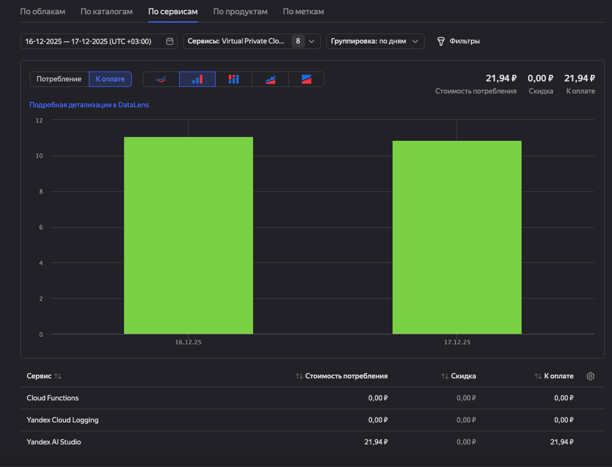

[](https://github.com/PyCQA/bandit)


[](https://hub.docker.com/r/eslazarev/ai-wildberries-review-responder)

# Сервис-автоответчик на отзывы Wildberries с YandexGPT или OpenAI

Этот сервис автоматически подхватывает новые отзывы из кабинета продавца Wildberries, генерирует ответ через LLM и отправляет его обратно. Он рассчитан на запуск в Yandex Cloud Functions, но может работать локально или в Docker.

## Содержание
- [Ключевые возможности](#ключевые-возможности)
- [Как работает сервис](#как-работает-сервис)
- [Стоимость использования](#стоимость-использования)
  - [Пример фактических расходов](#пример-фактических-расходов)
- [Быстрый старт](#быстрый-старт)
- [Требования и предварительная подготовка](#требования-и-предварительная-подготовка)
  - [Необходимые инструменты](#необходимые-инструменты)
  - [Получение API-токена Wildberries](#получение-api-токена-wildberries)
  - [Доступ к YandexGPT или OpenAI](#доступ-к-yandexgpt-или-openai)
- [Конфигурация приложения](#конфигурация-приложения)
  - [Файл settings.yaml](#файл-settingsyaml)
  - [Переменные окружения](#переменные-окружения)
  - [Приоритет настроек](#приоритет-настроек)
- [Структура проекта](#структура-проекта)
  - [Основные директории](#основные-директории)
  - [Точки входа](#точки-входа)
  - [Доменные и инфраструктурные слои](#доменные-и-инфраструктурные-слои)
- [Локальный запуск](#локальный-запуск)
  - [Установка зависимостей](#установка-зависимостей)
  - [Запуск одной итерации обработки](#запуск-одной-итерации-обработки)
  - [Запуск с локальным cron](#запуск-с-локальным-cron)
  - [Локальная отладка](#локальная-отладка)
- [Запуск в Yandex Cloud Functions (Serverless)](#запуск-в-yandex-cloud-functions-serverless)
  - [Установка и настройка Yandex CLI](#установка-и-настройка-yandex-cli)
  - [Сборка и деплой](#сборка-и-деплой)
  - [Cron-триггер и расписание](#cron-триггер-и-расписание)
  - [Удаление ресурсов](#удаление-ресурсов)
- [Запуск через Docker](#запуск-через-docker)
  - [Загрузка образа](#загрузка-образа)
  - [Разовый запуск контейнера](#разовый-запуск-контейнера)
  - [Запуск по расписанию внутри контейнера](#запуск-по-расписанию-внутри-контейнера)
- [Архитектура и внутреннее устройство](#архитектура-и-внутреннее-устройство)
  - [Поток обработки отзывов](#поток-обработки-отзывов)
  - [Оркестрация и бизнес-логика](#оркестрация-и-бизнес-логика)
  - [Изоляция домена](#изоляция-домена)
- [Тестирование и качество кода](#тестирование-и-качество-кода)
  - [Архитектурные тесты](#архитектурные-тесты)
  - [Статический анализ и безопасность](#статический-анализ-и-безопасность)
- [Расширение и кастомизация](#расширение-и-кастомизация)
  - [Изменение промптов](#изменение-промптов)
  - [Подключение другого LLM-провайдера](#подключение-другого-llm-провайдера)
- [Частые вопросы](#частые-вопросы)
- [Ограничения и известные особенности](#ограничения-и-известные-особенности)
- [Обратная связь и вклад в проект](#обратная-связь-и-вклад-в-проект)
- [Лицензия](#лицензия)

## Ключевые возможности
- **Полный контроль над доступом к API Wildberries, вы не делитесь токеном с третьими сторонами.**
- Очень простая настройка и деплой в Yandex Cloud Functions через Serverless Framework, справится любой!
- Возможность кастомизации промптов - как модель будет отвечать на отзывы.
- Регулярная обработка новых отзывов без сервера и постоянного процесса.
- Поддержка YandexGPT и OpenAI-совместимых моделей.
- Гибкая конфигурация через YAML и переменные окружения.
- Несколько сценариев запуска: Yandex Cloud Functions, Docker, локально.

## Как работает сервис
1. По расписанию функция запрашивает список неотвеченных отзывов в Wildberries.
2. Каждый отзыв превращается в индивидуальный промпт для LLM с включением деталей отзыва и даже наличия фото или видео.
3. LLM генерирует ответ в нужном тоне и языке.
4. Ответ отправляется обратно в Wildberries Feedbacks API.

## Стоимость использования
- Код бесплатный и открытый.
- Расходы зависят от облака, модели и числа отзывов.
- Yandex Cloud Functions тарифицируется по времени выполнения и памяти.
- YandexGPT или OpenAI тарифицируются по токенам.
- Wildberries Feedbacks API бесплатен в пределах лимитов кабинета продавца.

### Пример фактических расходов


Производственные замеры показали стоимость около **0,25 рубля за один отзыв**. 
На скриншоте за два дня было отвечено примерно на 100 отзывов.

## Быстрый старт
Если всё уже настроено (YC, доступы, токены), достаточно:
Это соберёт и задеплоит функцию в Yandex Cloud Functions и настроит cron-триггер (который будет запускать функцию по расписанию).
```bash
npm install
WILDBERRIES__API_TOKEN='your_wb_token' serverless deploy
```
Опционально можно указать ключ LLM или изменить расписание:
```bash
LLM__API_KEY='your_llm_api_key' WILDBERRIES__API_TOKEN='your_wb_token' serverless deploy
WILDBERRIES__CHECK_EVERY_MINUTES='15' WILDBERRIES__API_TOKEN='your_wb_token' serverless deploy
```

## Требования и предварительная подготовка

### Необходимые инструменты
- Python 3.12+ и `pip` для локальных запусков и тестов.
- Node.js 18+ и `npm` для Serverless Framework.
- Установленный CLI `yc` для работы с Yandex Cloud.

### Получение API-токена Wildberries
1. В кабинете продавца откройте «Профиль → Настройки → Доступ к API → Отзывы и вопросы».
2. Создайте новый ключ и передайте его через переменную окружения `WILDBERRIES__API_TOKEN`.
3. Документация по токенам: https://dev.wildberries.ru/openapi/api-information#tag/Avtorizaciya/Kak-sozdat-personalnyj-bazovyj-ili-testovyj-token

### Доступ к YandexGPT или OpenAI
- Для YandexGPT в Yandex Cloud Functions нужен сервисный аккаунт с ролью `ai.languageModels.user` (описано в `serverless.yml`).
- Внутри Cloud Functions можно не задавать `LLM__API_KEY`: функция подставит IAM-токен из `context.token`, если ключ пустой или равен `null`.
- Для OpenAI или другого OpenAI-совместимого API укажите `LLM__API_KEY`, `LLM__MODEL` и `LLM__BASE_URL`.

## Конфигурация приложения

### Файл settings.yaml
`settings.yaml` — основной источник настроек, если их не перекрыли переменными окружения. Пример структуры:
```yaml
wildberries: # Блок настроек для Wildberries API.
  base_url: "https://feedbacks-api.wildberries.ru" # Базовый URL API отзывов.
  request_timeout: 10 # Таймаут HTTP-запросов, секунды.
  batch_size: 10 # Сколько отзывов обрабатывать за один запуск.
  check_every_minutes: 30 # Период запуска в минутах для cron-режимов.

llm: # Блок настроек LLM-провайдера.
  model: "gpt://{FOLDER_ID}/aliceai-llm/latest" # Идентификатор модели; {FOLDER_ID} подставится в YC.
  base_url: "https://rest-assistant.api.cloud.yandex.net/v1" # Базовый URL LLM API.
  temperature: 0.3 # Степень креативности ответа (меньше = стабильнее).
  max_tokens: 600 # Максимум токенов в ответе модели.
  instructions: "..." # Системные инструкции модели.
  prompt_template: "..." # Шаблон промпта для текста отзыва.
  timeout: 10 # Таймаут запросов к LLM, секунды.
```
`{FOLDER_ID}` в модели автоматически заменяется в Yandex Cloud Functions.

### Переменные окружения
Переменные строятся из вложенных ключей через `__`:
- `WILDBERRIES__API_TOKEN` — обязательный токен доступа к отзывам.
- `WILDBERRIES__BASE_URL` — URL API (обычно не трогается).
- `WILDBERRIES__REQUEST_TIMEOUT`, `WILDBERRIES__BATCH_SIZE`, `WILDBERRIES__CHECK_EVERY_MINUTES`.
- `LLM__API_KEY` — ключ LLM (для YC Functions можно оставить пустым/`null`).
- `LLM__MODEL`, `LLM__BASE_URL`, `LLM__TEMPERATURE`, `LLM__MAX_TOKENS`, `LLM__INSTRUCTIONS`, `LLM__PROMPT_TEMPLATE`, `LLM__TIMEOUT`.

### Приоритет настроек
Приоритет источников такой: переменные окружения → `.env` → файловые секреты → `settings.yaml`. То есть YAML — это безопасный дефолт, а любые env-настройки его перекрывают.

## Структура проекта

### Основные директории
- `src/domain` — чистые модели и сущности.
- `src/application` — оркестрация и порты.
- `src/infra` — клиенты API, логирование, интеграции.
- `src/entrypoints` — сценарии запуска.
- `tests` — тесты, включая архитектурные.

### Точки входа
- `src.entrypoints.yandex_cloud_function` — обработчик для Yandex Cloud Functions.
- `src.entrypoints.docker_once` — разовый запуск обработки.
- `src.entrypoints.docker_cron` — запуск с внутренним расписанием.

### Доменные и инфраструктурные слои
Доменные модели не зависят от приложения и инфраструктуры, приложение — от инфраструктуры. Эти границы проверяются тестами в `tests/test_architecture.py`.

## Локальный запуск

### Установка зависимостей
```bash
python -m venv .venv
source .venv/bin/activate
pip install -r requirements-dev.txt
```

### Запуск одной итерации обработки
```bash
export WILDBERRIES__API_TOKEN='your_wb_token'
export LLM__API_KEY='your_llm_api_key'
python -m src.entrypoints.docker_once
```

### Запуск с локальным cron
```bash
export WILDBERRIES__API_TOKEN='your_wb_token'
python -m src.entrypoints.docker_cron
```
Интервал берётся из `wildberries.check_every_minutes`.

### Локальная отладка
- Можно указать `WILDBERRIES__BASE_URL` и `LLM__BASE_URL` на тестовые или локальные сервисы.
- Для проверки полной цепочки полезен `tests/test_e2e.py`, он поднимает фейковые HTTP-серверы.

## Запуск в Yandex Cloud Functions (Serverless)

### Установка и настройка Yandex CLI
Документация по установке: https://cloud.yandex.ru/docs/cli/quickstart
```bash
curl https://storage.yandexcloud.net/yandexcloud-yc/install.sh | bash
yc init
```

### Сборка и деплой
```bash
npm install
WILDBERRIES__API_TOKEN='your_wb_token' serverless deploy
```
Опциональные параметры:
```bash
LLM__API_KEY='your_llm_api_key' WILDBERRIES__API_TOKEN='your_wb_token' serverless deploy
WILDBERRIES__CHECK_EVERY_MINUTES='15' WILDBERRIES__API_TOKEN='your_wb_token' serverless deploy
```

### Cron-триггер и расписание
Расписание берётся из `wildberries.check_every_minutes` (по умолчанию 30). Для изменения без правки YAML можно передать `WILDBERRIES__CHECK_EVERY_MINUTES` при деплое и повторить `serverless deploy`.

### Удаление ресурсов
```bash
serverless remove
```

## Запуск через Docker

### Загрузка образа
```bash
docker pull eslazarev/ai-wildberries-review-responder:latest
```

### Разовый запуск контейнера
По умолчанию образ запускает режим с расписанием. Для разового прогона укажите `src.entrypoints.docker_once`.
```bash
docker run --rm \
  -e WILDBERRIES__API_TOKEN='your_wb_token' \
  -e LLM__API_KEY='your_llm_api_key' \
  eslazarev/ai-wildberries-review-responder:latest src.entrypoints.docker_once
```

### Запуск по расписанию внутри контейнера
```bash
docker run --rm \
  -e WILDBERRIES__API_TOKEN='your_wb_token' \
  -e WILDBERRIES__CHECK_EVERY_MINUTES='15' \
  -e LLM__API_KEY='your_llm_api_key' \
  eslazarev/ai-wildberries-review-responder:latest
```

## Архитектура и внутреннее устройство

### Поток обработки отзывов
- Клиент WB получает список неотвеченных отзывов (`/api/v1/feedbacks`).
- `PromptBuilder` формирует промпт с полным JSON-пейлоадом отзыва.
- LLM возвращает готовый ответ.
- Клиент WB публикует ответ (`/api/v1/feedbacks/answer`).

### Оркестрация и бизнес-логика
`respond_on_reviews` в `src/application/respond_on_reviews.py` управляет потоком: загрузить отзывы, получить ответы, опубликовать их. Конкретные реализации подставляются через порты.

### Изоляция домена
Доменные модели не знают об инфраструктуре, а приложение не зависит от конкретных интеграций. Это позволяет менять клиентов API и LLM без переписывания логики.

## Тестирование и качество кода

### Архитектурные тесты
```bash
pytest -m architecture
```

### Статический анализ и безопасность
```bash
make lint
make test
make ci
```

## Расширение и кастомизация

### Изменение промптов
Самый удобный способ — править `llm.prompt_template` и `llm.instructions` в `settings.yaml`. Для быстрых экспериментов можно использовать `LLM__PROMPT_TEMPLATE` и `LLM__INSTRUCTIONS`.

### Подключение другого LLM-провайдера
Сервис использует OpenAI-совместимый клиент. Достаточно задать:
```bash
export LLM__BASE_URL='https://api.openai.com/v1'
export LLM__MODEL='gpt-4o-mini'
export LLM__API_KEY='your_key'
```

## Частые вопросы
**Нужно ли задавать `LLM__API_KEY` в Yandex Cloud Functions?**
Если используете YandexGPT внутри Cloud Functions, ключ не обязателен: IAM-токен будет взят из контекста.

**Как изменить частоту запуска?**
Поменяйте `wildberries.check_every_minutes` в `settings.yaml` и задеплойте заново, либо задайте `WILDBERRIES__CHECK_EVERY_MINUTES` при деплое.

**Можно ли отвечать только на часть отзывов?**
Сервис обрабатывает пачку неотвеченных отзывов размером `wildberries.batch_size`. Фильтрация по кастомным правилам не реализована.

## Ограничения и известные особенности
- Ответы отправляются последовательно; параллелизм и ретраи не реализованы.
- Нет встроенного ограничения по длине ответа, контроль лежит на промпте и настройках модели.
- История обработанных отзывов не хранится, сервис опирается на флаг `isAnswered` в API Wildberries.
- В Docker-режиме расписание работает через встроенный cron APScheduler, а в YC — через серверлесс-триггер.

## Обратная связь и вклад в проект
Идеи, баги и предложения удобно оставлять в Issues. Пулл-реквесты приветствуются — по возможности приложите тесты и краткое описание изменений.

## Лицензия
Проект распространяется по лицензии MIT. Подробности — в `LICENSE`.
