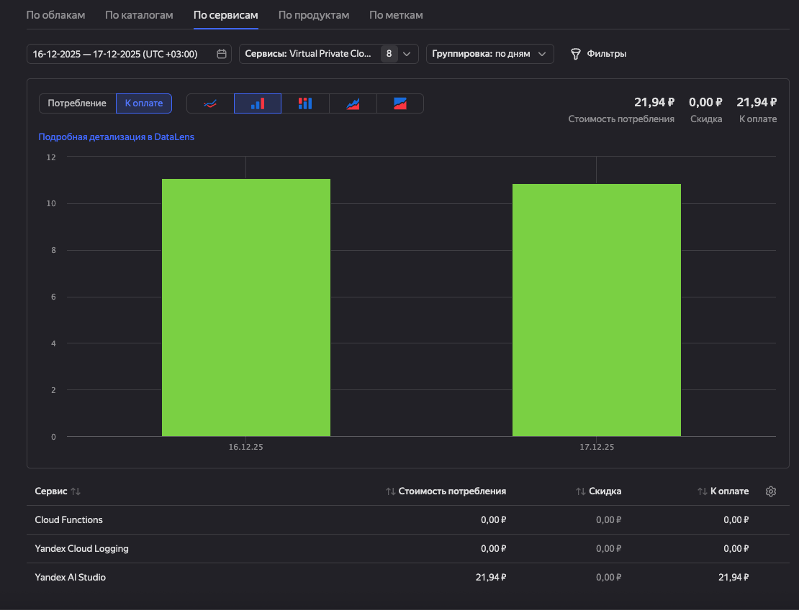

# Wildberries müşteri yorumlarına yapay zekâ ile otomatik yanıt servisi

🌐 [Русский](../../README.md) · [English](README.en.md) · [简体中文](README.zh-CN.md) · **Türkçe** · [Қазақша](README.kk.md) · [Oʻzbekcha](README.uz.md)


[](https://artifacthub.io/packages/search?repo=ai-wildberries-review-responder)
[](https://hub.docker.com/r/eslazarev/ai-wildberries-review-responder)


Bu servis, Wildberries satıcı panelinden yeni yorumları otomatik olarak alır, bir LLM aracılığıyla yanıt üretir ve geri gönderir. Varsayılan olarak Yandex Cloud Functions üzerinde çalışır; yerel ortamda, Docker'da veya yayınlanan Helm chart ile herhangi bir Kubernetes kümesinde de çalıştırılabilir.

> Türk satıcılar için: WB Türkiye pazarındaki yorumlara Rusça veya Türkçe yanıt vermek için ideal. Promptu kendi diline ayarlayabilirsin.

## Temel özellikler
- **Wildberries API token'ınız üzerinde tam kontrol — üçüncü taraflarla paylaşmanıza gerek yok.**
- Serverless Framework ile Yandex Cloud Functions'a tek komutla deploy.
- Promptlar tamamen özelleştirilebilir.
- Sürekli çalışan bir sunucu olmadan periyodik işleme.
- YandexGPT ve OpenAI uyumlu her API destekli (OpenAI, Ollama, vLLM vb.).
- YAML ve ortam değişkenleri ile esnek yapılandırma.
- Birden fazla çalıştırma modu: Yandex Cloud Functions, Docker, Kubernetes (Helm), yerel.

## Nasıl çalışır
1. Belirlenen aralıkla Wildberries'ten yanıtlanmamış yorumların listesi alınır.
2. Her yorum için ayrı bir prompt oluşturulur (yorum detayları ve fotoğraf/video varlığı dahil).
3. LLM uygun ton ve dilde yanıt üretir.
4. Yanıt Wildberries Feedbacks API üzerinden geri gönderilir.

## Maliyet
- Kod tamamen ücretsiz ve açık kaynaklı.
- İşletim maliyeti bulut, model ve yorum hacmine bağlı.
- Yandex Cloud Functions: yürütme süresi ve bellek başına ücret.
- YandexGPT veya OpenAI: token başına ücret.
- Wildberries Feedbacks API: satıcı hesabı limitleri içinde ücretsiz.

Üretim ölçümleri ≈ **yanıt başına 0,25 ₽** göstermektedir (aşağıdaki ekran görüntüsü iki gün içinde ≈100 yorum yanıtının maliyetidir):



## Hızlı başlangıç

Her şey ayarlıysa (YC, erişim, token'lar) tek komut yeterli:

```bash
npm install
WILDBERRIES__API_TOKEN='wb_token_unuz' serverless deploy
```

Bu, fonksiyonu Yandex Cloud Functions'a deploy eder ve cron tetikleyici oluşturur.

İsteğe bağlı parametreler:

```bash
LLM__API_KEY='llm_api_key_unuz' WILDBERRIES__API_TOKEN='wb_token_unuz' serverless deploy
WILDBERRIES__CHECK_EVERY_MINUTES='15' WILDBERRIES__API_TOKEN='wb_token_unuz' serverless deploy
```

## Gereksinimler

- Python 3.12+ ve `pip` (yerel çalıştırma ve testler).
- Node.js 18+ ve `npm` (Serverless Framework).
- `yc` CLI (Yandex Cloud).

### Wildberries API token'ı
1. Satıcı panelinde *Profil → Ayarlar → API erişimi → Yorumlar ve sorular*.
2. Yeni anahtar oluşturup `WILDBERRIES__API_TOKEN` olarak iletin.
3. Token belgeleri: <https://dev.wildberries.ru/openapi/api-information>

### YandexGPT veya OpenAI erişimi
- YandexGPT (Cloud Functions içinde): `ai.languageModels.user` rolüne sahip servis hesabı (`serverless.yml` içinde tanımlı).
- Cloud Functions içinde `LLM__API_KEY` boş bırakılabilir — fonksiyon `context.token`'dan IAM token'ı kullanır.
- OpenAI veya başka bir OpenAI uyumlu API için `LLM__API_KEY`, `LLM__MODEL` ve `LLM__BASE_URL` ayarlanır.

### Ollama ile yerel model
[Ollama](https://ollama.com), `http://localhost:11434/v1` adresinde OpenAI uyumlu API yayınlar:

```yaml
llm:
  base_url: "http://localhost:11434/v1"
  model: "gemma3:4b"
  api_key: "ollama"
```

## Yapılandırma

`settings.yaml` ana konfigürasyon kaynağıdır; ortam değişkenleriyle ezilebilir.

Ortam değişkenleri öncelik sırası: `env vars → .env → file secrets → settings.yaml`.

Anahtarlar `__` ayırıcısıyla yazılır:
- `WILDBERRIES__API_TOKEN`, `WILDBERRIES__BATCH_SIZE`, `WILDBERRIES__CHECK_EVERY_MINUTES`, ...
- `LLM__API_KEY`, `LLM__MODEL`, `LLM__BASE_URL`, `LLM__TEMPERATURE`, `LLM__MAX_TOKENS`, ...

## Yerel çalıştırma

```bash
python -m venv .venv
source .venv/bin/activate
pip install -r requirements-dev.txt

export WILDBERRIES__API_TOKEN='wb_token_unuz'
export LLM__API_KEY='llm_api_key_unuz'
python -m src.entrypoints.docker_once
```

Yerel cron modu:
```bash
python -m src.entrypoints.docker_cron
```

## Yandex Cloud Functions

```bash
curl https://storage.yandexcloud.net/yandexcloud-yc/install.sh | bash
yc init

npm install
WILDBERRIES__API_TOKEN='wb_token_unuz' serverless deploy

# Tüm kaynakları sil
serverless remove
```

## Docker

```bash
docker pull eslazarev/ai-wildberries-review-responder:latest

# Tek seferlik çalıştırma
docker run --rm \
  -e WILDBERRIES__API_TOKEN='wb_token_unuz' \
  -e LLM__API_KEY='llm_api_key_unuz' \
  eslazarev/ai-wildberries-review-responder:latest src.entrypoints.docker_once
```

## Kubernetes (Helm chart)

```bash
helm repo add wb-responder https://eslazarev.github.io/ai-wildberries-review-responder
helm repo update
helm install wb-responder wb-responder/ai-wildberries-review-responder \
  --namespace wb-responder --create-namespace \
  --set secrets.wildberriesApiToken=$WILDBERRIES_API_TOKEN \
  --set secrets.llmApiKey=$LLM_API_KEY

# Manuel tetikleme
kubectl create job --from=cronjob/wb-responder-ai-wildberries-review-responder manual -n wb-responder
kubectl logs -n wb-responder -l app.kubernetes.io/instance=wb-responder --tail=200 -f
```

Chart [Artifact Hub](https://artifacthub.io/packages/helm/ai-wildberries-review-responder/ai-wildberries-review-responder) üzerinde yayınlanmaktadır. Tam parametre listesi: [`charts/ai-wildberries-review-responder/README.md`](../../charts/ai-wildberries-review-responder/README.md).

## Mimari

- **Domain** (`src/domain`) — saf veri sınıfları.
- **Application** (`src/application`) — kullanım senaryoları ve portlar.
- **Infrastructure** (`src/infra`) — API istemcileri, loglama, entegrasyonlar.
- **Entrypoints** (`src/entrypoints`) — YC handler, tek seferlik, cron.

Katman sınırları `tests/test_architecture.py` testleriyle doğrulanır.

## Sınırlamalar

- Yanıtlar sırayla gönderilir; paralel işlem ve yeniden deneme yok.
- Yanıt uzunluğunda dahili sınır yok; prompt ve model ayarları kontrol eder.
- İşlenen yorumların geçmişi tutulmaz; WB API'sındaki `isAnswered` bayrağına dayanır.
- Docker modu yerleşik APScheduler kullanır; YC modunda serverless tetikleyici.

## Katkı

Sorunlar, fikirler ve özellik istekleri için Issues açın. PR'lar memnuniyetle karşılanır — mümkünse test ve kısa açıklama ekleyin.

## Lisans

MIT — bkz. [`LICENSE`](../../LICENSE).
